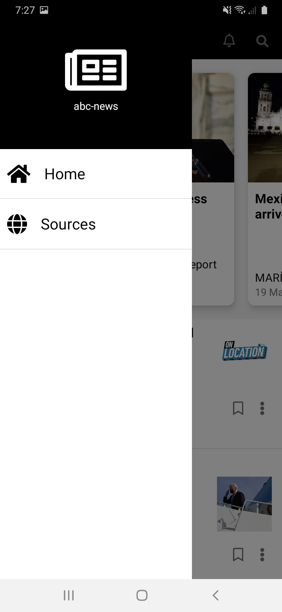
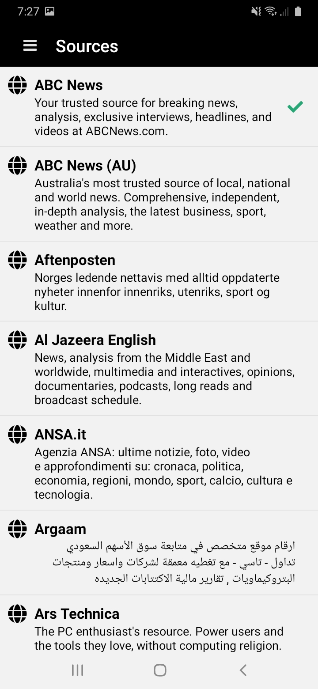

# React Native Test-Gabriel

This is a react native test using React Native + TypeScript

## Technology

- React Native
- React Navigation
- React Native Async Storage
- Axios
- Moment
- React Native Vector Icons
- React Native WebView
- TypeScript

## Requirements

- [Node.js v10+](https://nodejs.org/)
- [React Native CLI](https://www.npmjs.com/package/react-native-cli)
- Xcode Command Line tools (`xcode-select --install`)
- [CocoaPods](https://cocoapods.org/) (`gem install cocoapods`)

## Preview

Home Screen                |  Detail Screen
:-------------------------:|:-------------------------:
  |  

Main Menu View             |  Sources Screen
:-------------------------:|:-------------------------:
 |  

